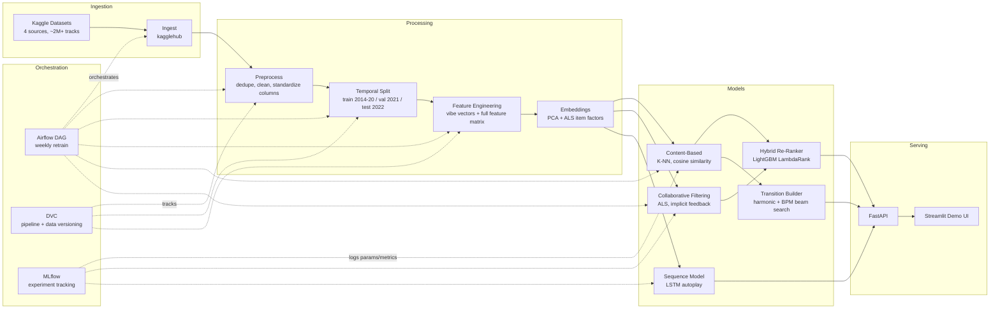

# TuneMatch - Attempt at rivaling Apple Music's Autoplay function

**Audio-feature-aware music recommendation engine** — matches songs by *vibe* (danceability, energy, valence, acousticness, tempo) rather than relying on genre tags or collaborative popularity alone.

Built as an end-to-end ML system: data ingestion → feature engineering → multi-layer recommendation models → orchestration → serving.

---

## The Problem

Most consumer recommendation engines (Apple Music's autoplay included) lean heavily on genre metadata and popularity to decide what plays next. That approach breaks down for anyone whose taste doesn't map cleanly onto a single genre — a low-energy, moody hip-hop track and a low-energy, moody R&B track can be a perfect match for each other despite sitting in different genre buckets, while two songs tagged with the same genre can feel nothing alike.

TuneMatch instead represents every track as a vector of its raw audio characteristics (a "vibe vector") and recommends by similarity in that space, with genre as one signal among several rather than the primary key.

**Baseline it has to beat:** a genre-popularity baseline (`src/evaluation/baseline.py`) — recommend the most popular tracks in the same genre as the seed. If the vibe-based model can't outperform that on precision/recall/NDCG, it isn't earning its complexity.

---

## Architecture



The system is layered rather than monolithic — each model handles a different recommendation mode, and the API picks which one to invoke based on what the request needs (a cold-start seed song vs. a logged-in user's history vs. a DJ-style transition set).

| Layer | Model | Handles |
|---|---|---|
| Content-based | K-NN, cosine similarity over vibe vectors | Cold start — works from a single seed song, no user history required |
| Collaborative filtering | ALS (implicit feedback) | Personalization from listening history (play counts) |
| Hybrid re-ranker | LightGBM, LambdaRank objective | Blends content + CF scores into one ranked list |
| Sequence model | LSTM over track-embedding sequences | Autoplay — predicts the next song from recent listening order |
| Transition builder | Beam search over a harmonic-compatibility graph | "DJ mode" — orders a set of songs so each blends into the next |

---

## Methodology

### 1. Feature engineering — the vibe vector

Every track is reduced to 8 audio features known to characterize how a song *feels* rather than what it's classified as: `danceability`, `energy`, `valence`, `acousticness`, `instrumentalness`, `tempo`, `speechiness`, `liveness`. `speechiness` in particular is what separates hip-hop/R&B from pop/EDM at similar energy levels, so it's a deliberate inclusion rather than a default.

These features arrive on wildly different scales — most are already 0–1, but `tempo` is BPM (roughly 40–250) and `loudness` is negative dB. Feeding that directly into a distance-based similarity metric lets `tempo` dominate the distance calculation purely because its numbers are bigger, not because it's musically more important. Every vibe feature is normalized to [0, 1] with `MinMaxScaler` before similarity is computed (`src/features/audio_features.py::normalize_vibe_vector`); the broader feature set used for the ML models (hybrid ranker inputs, PCA embeddings) is separately standardized with `StandardScaler` plus one-hot encoding for categorical features like key and mode.

### 2. Similarity metric — cosine, not Euclidean

The content-based recommender (`src/models/content_based.py`) uses **cosine similarity**, not Euclidean distance. Euclidean distance measures absolute difference in each dimension and is sensitive to vector magnitude — two songs that are proportionally identical in vibe (same relative balance of energy, valence, danceability, etc.) but scaled slightly differently in magnitude get penalized as dissimilar. Cosine similarity measures the angle between vectors instead, which is what actually matters for "does this song feel the same way," independent of scale. Combined with feature normalization, this is what keeps recommendations genre-coherent instead of drifting toward whatever tracks happen to sit near the origin of an unscaled Euclidean space.

### 3. Temporal train/val/test split

Splits are by release year, not randomly (`src/data/split.py`): train on 2014–2020, validate on 2021, test on 2022. A random split would leak future-sounding production trends into training and make the model look better than it would be in production, where it always has to recommend from music it hasn't necessarily "seen" the aesthetic of yet. This mirrors how a real deployed model would be evaluated.

### 4. Collaborative filtering — ALS over SVD

Listening data here is implicit feedback (play counts), not explicit ratings, which is why the collaborative layer uses **ALS (Alternating Least Squares)** via the `implicit` library rather than SVD or NMF — ALS with confidence weighting is built for exactly this kind of implicit-feedback signal and scales to sparse, large user × item matrices.

### 5. Hybrid re-ranking

The content-based and collaborative models each produce a relevance score; `src/models/hybrid.py` trains a LightGBM model with a **LambdaRank** objective (optimizes ranking quality directly via NDCG, not classification accuracy) to combine those two scores plus raw audio features, popularity, and genre-match into one final ranking.

### 6. Harmonic transition playlists ("DJ mode")

`src/features/harmonic.py` implements the **Camelot Wheel**, the harmonic-mixing system DJs use to judge whether two keys mix cleanly, and pairs it with BPM compatibility (including half/double-tempo matches) to score how smoothly one track flows into another. `src/models/transition.py` then runs a **beam search** over that compatibility graph to find an ordered playlist that maximizes cumulative transition smoothness, with an "energy arc" bonus that shapes whether the set builds gradually, peaks in the middle, or stays flat.

### 7. Evaluation

`src/evaluation/metrics.py` implements Precision@K, Recall@K, and NDCG@K (K = 5, 10, 20), plus catalog Coverage, playlist Diversity (mean pairwise vibe distance), and Novelty (inverse popularity). Every model is compared against the genre-popularity baseline described above — the whole point of the vibe-vector approach is that it should beat "just recommend popular songs in the same genre," and that comparison is what would validate it.

---

## Tech Stack

| Category | Tools |
|---|---|
| Data / DE | Python, Pandas, PyArrow (Parquet), DVC (pipeline + data versioning) |
| ML | scikit-learn (K-NN, preprocessing), LightGBM, `implicit` (ALS), PyTorch (LSTM) |
| Orchestration | Apache Airflow (weekly retrain DAG) |
| Experiment tracking | MLflow |
| Serving | FastAPI, Streamlit |
| Infra | Docker, Docker Compose |
| Data sources | 4 Kaggle datasets (Spotify audio features, Million Song Dataset + Last.fm listening history, 1.2M-track and 30K-track Spotify sets) |

---

## Project Structure

```
tunematch/
├── airflow/dags/           # Weekly retraining DAG
├── app/                    # Streamlit demo UI
├── config/config.yaml      # All hyperparameters, paths, feature lists
├── src/
│   ├── data/                # ingest → preprocess → split
│   ├── features/            # audio_features (vibe vectors), embeddings, harmonic
│   ├── models/               # content_based, collaborative, hybrid, sequence, transition
│   ├── evaluation/           # metrics + genre baseline
│   └── api/                  # FastAPI app + schemas
├── dvc.yaml                # DVC pipeline stage definitions
├── run_pipeline.py         # One-shot local pipeline runner (no Airflow needed)
├── docker-compose.yml       # MLflow + API + Streamlit + Airflow, containerized
└── tests/
```

---

## Setup & Usage

**Requirements:** Python 3.12, a Kaggle API token (for dataset download)

```bash
# 1. Clone and install
git clone https://github.com/DS-Ticket/TuneMatch.git
cd TuneMatch
python -m venv .venv && source .venv/bin/activate
pip install -r requirements.txt

# 2. Configure environment
cp .env.example .env   # add your Kaggle API credentials

# 3. Run the full pipeline (ingest → preprocess → split → features → train)
python run_pipeline.py

# or run individual steps:
python run_pipeline.py --steps ingest preprocess split

# 4. Launch the demo
streamlit run app/streamlit_app.py     # interactive UI
python -m src.api.app                  # REST API on :8000
mlflow ui --port 5000                  # experiment tracking UI
```

**Or with Docker Compose** (spins up MLflow, the API, Streamlit, and Airflow together):

```bash
docker-compose up
```

DVC (`dvc.yaml`) mirrors the pipeline stages for reproducible, versioned re-runs (`dvc repro`), and the Airflow DAG (`airflow/dags/tunematch_pipeline.py`) automates the same pipeline on a weekly retrain schedule in production.

---

## Roadmap

- [ ] Populate results section with Precision/Recall/NDCG @K, content-based vs. genre baseline, from a full pipeline run on held-out test data
- [ ] Screenshots / demo GIF of the Streamlit UI
- [ ] Train and evaluate the hybrid LightGBM re-ranker end-to-end (currently scaffolded, not yet trained on assembled ranking data)
- [ ] Train and evaluate the LSTM sequence model on real playlist sequences
